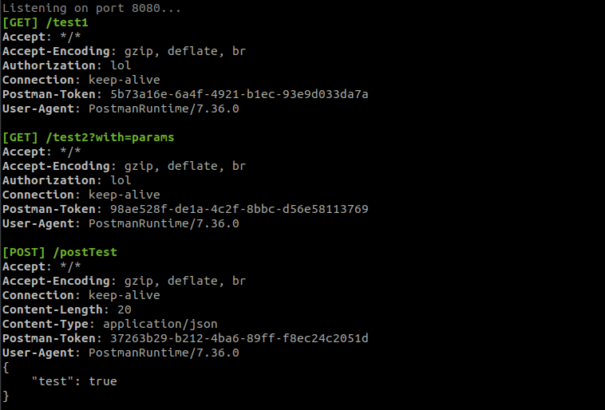

# HTTP Request Debug

View incoming requests and their headers/body.

### Build

```shell
git clone https://github.com/0xbarbs/http-request-debug

cd http-request-debug && go get && go build
```

### Run

```shell
# Listen on default port 8080
./http-request-debug

# Listen on a custom port
./http-request-debug --port 1234
```

### Preview

